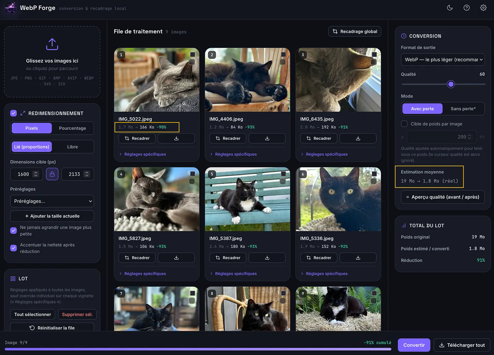
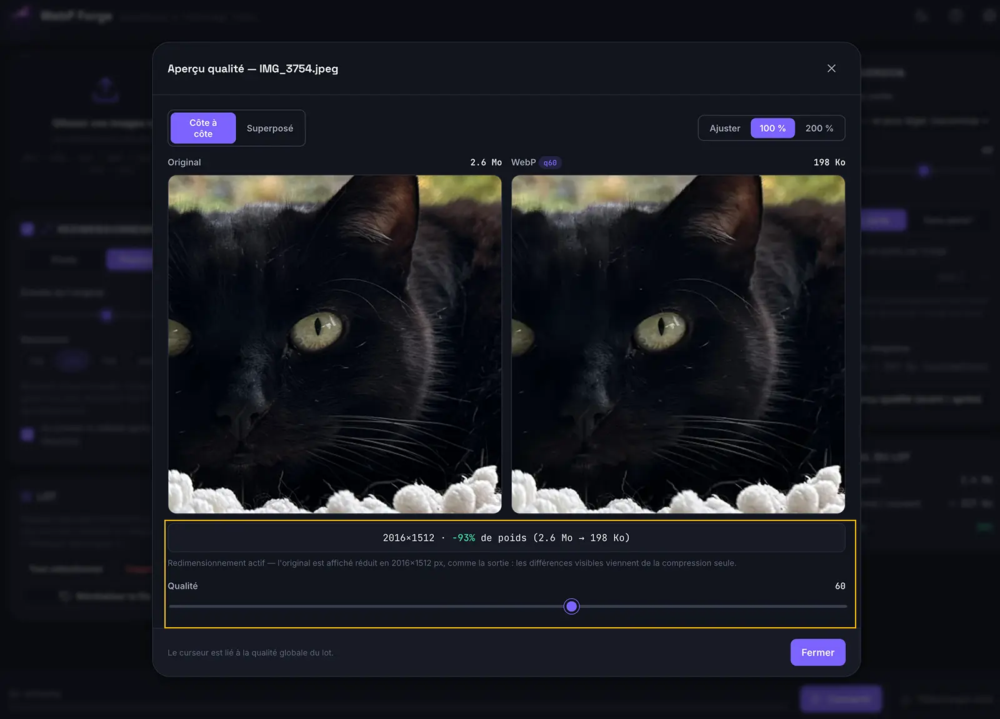
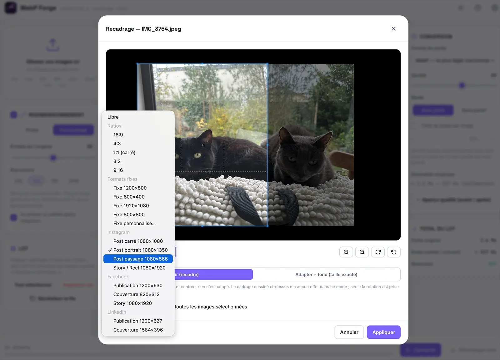
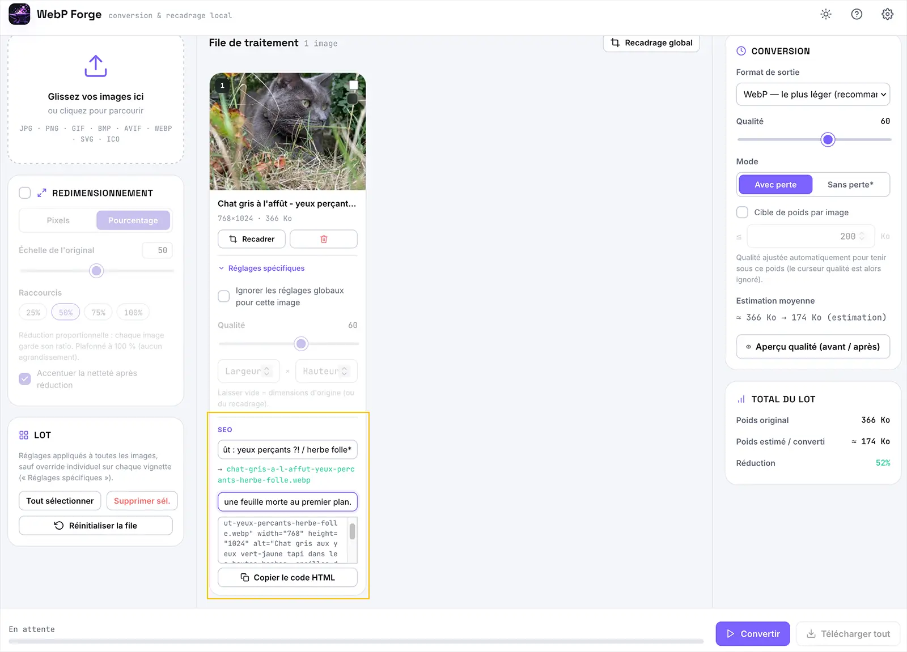

# WebP Forge

**Convertisseur et optimiseur d'images qui fonctionne entièrement sur votre poste.**
Un seul fichier HTML. Aucune installation, aucun compte, aucun serveur.

---

## Vos images ne quittent jamais votre appareil

Tout le traitement s'exécute dans votre navigateur. Aucune image, aucune donnée
et aucune statistique d'usage n'est transmise où que ce soit — il n'y a pas de
serveur à contacter. Vous pouvez couper votre connexion réseau et l'outil
continue de fonctionner à l'identique.

C'est la différence de fond avec les convertisseurs en ligne, qui envoient vos
fichiers à un tiers pour les traiter.

## Utilisation

1. Téléchargez `webp-forge.html`.
2. Double-cliquez dessus. C'est tout.

Ajoutez-le à vos favoris pour le relancer d'un clic. Le fichier étant autonome,
il fonctionne aussi bien depuis un disque local qu'un lecteur réseau partagé.

Le fichier pèse environ 850 Ko, et c'est normal : il embarque tout ce dont il a
besoin pour se passer d'internet — l'encodeur libwebp compilé en WebAssembly,
la bibliothèque de compression ZIP, les polices et le logo. Rien n'est chargé
depuis l'extérieur, ni au lancement ni pendant l'usage.

## Ce qu'il fait

- **Conversion** — entrée JPG, PNG, GIF, BMP, AVIF, SVG, ICO, WebP ;
  sortie WebP, PNG, JPG, BMP, ICO. La conversion fonctionne dans les deux sens.
- **Traitement par lot** avec pause et annulation, export en ZIP.
- **Redimensionnement** en pixels ou en pourcentage, préréglages personnalisables,
  accentuation automatique après réduction.
- **Recadrage** libre, par ratio, ou aux formats Instagram / Facebook / LinkedIn.
- **Contrôle qualité** — comparateur avant/après à curseur, zoom synchronisé,
  cible de poids (« ≤ 200 Ko ») avec recherche automatique de la qualité.
- **Pack SEO** — nommage de fichier propre, attribut `alt`, snippet ``
  prêt à coller.

## Aperçu

**Rien à comprendre pour commencer.** Un écran d'aide s'affiche au premier
lancement et résume l'outil en trois étapes. Les réglages par défaut conviennent
à la grande majorité des cas.

**Traitement par lot.** Neuf photos d'iPhone déposées d'un coup : 19 Mo au
départ, 1,8 Mo en sortie, soit **91 % de poids en moins**. Le gain est affiché
par image et pour l'ensemble du lot.

**Vérification de la qualité.** Le comparateur affiche l'original et le résultat
côte à côte, avec zoom synchronisé jusqu'à 200 %. Ici, **93 % de poids en moins**
sans différence perceptible.

**Recadrage.** Libre, par ratio, ou aux dimensions exactes attendues par
Instagram, Facebook et LinkedIn — sans avoir à les connaître par cœur.

**Nommage et accessibilité.** Le nom de fichier est nettoyé automatiquement,
quels que soient les caractères saisis : accents, ponctuation et espaces
deviennent un nom lisible et compatible web. Le texte alternatif et un extrait
`` prêt à coller sont générés dans la foulée.

## Compatibilité

Chrome, Edge, Firefox et Safari. Safari n'encode pas le WebP nativement :
l'outil embarque un encodeur libwebp compilé en WebAssembly qui prend le relais,
de façon transparente.

## Vérifier par vous-même

L'affirmation « rien ne sort de votre poste » n'a d'intérêt que si vous pouvez la
contrôler. Trois façons de le faire, de la plus simple à la plus rigoureuse :

- **Coupez le réseau**, puis utilisez l'outil. Tout continue de fonctionner.
- **Ouvrez l'onglet Réseau** des outils de développement du navigateur (touche
  `F12`), puis convertissez une image : aucune requête sortante n'apparaît.
- **Lisez le fichier.** C'est du HTML et du JavaScript en clair. Une recherche
  sur `http` n'y trouve que des adresses en commentaire, dans les en-têtes de
  licence des composants tiers — aucune n'est appelée par le code.

## Licence

Apache 2.0 — voir [LICENSE](LICENSE). Les composants tiers embarqués et leurs
licences respectives sont listés dans [NOTICE](NOTICE).

Fourni en l'état, sans garantie (sections 7 et 8 de la licence).

---

Forgé en local par **Capsule07**.
